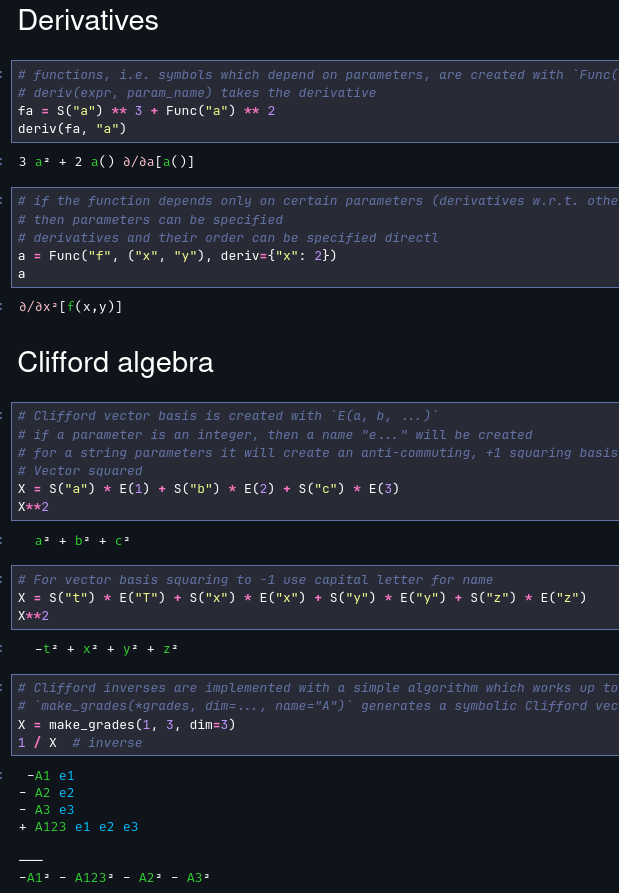

# Algebrant
Simple symbolic algebra with support for:

* symbolic algebra
* non-commutative symbolic algebra
* Clifford algebra
* Clifford algebra matrix representations

Meant to be small and structured enough to be extensible.

# Installation

Currently, clone from Git and include the `src/` directory in PYTHONPATH or with `sys.path.append(..)`.

Required libraries (from `pyproject.toml` with `pip install .`):

* python>=3.10
* numpy
* colorful (for color output in Jupyter)
* ipython (only to set up color output)

# Usage

See `examples/Example.ipynb` for examples. You get most functionality from just `from algebrant import *`.

It should look like

Some output may look different since I use my personal IPython pretty-print settings and the Dracula theme.

# Current limitations

* code documentation missing; internals may change
* symbols in numpy matrices currently do not use the color output
* quotient is very rudimentary (obtained when you divide by a symbolic expression)
* no complex simplification of expressions
* degenerate Clifford vectors are experimental with underscore `E("_a")`, but not set up for operations like conjugate
* Clifford inverse uses a simple algorithm which is guaranteed to work only up to dimension 5 (you could use matrix representations to find the inverses of any multivector)
* matrix representations only support even Clifford dimensions (you could use 1 dimension higher)
* experimental particle algebra does not interact with Clifford algebra
* only integer powers of expressions are supported
* Clifford square root `mv_sqrt()` only works for special multi-vectors
* small display issues
